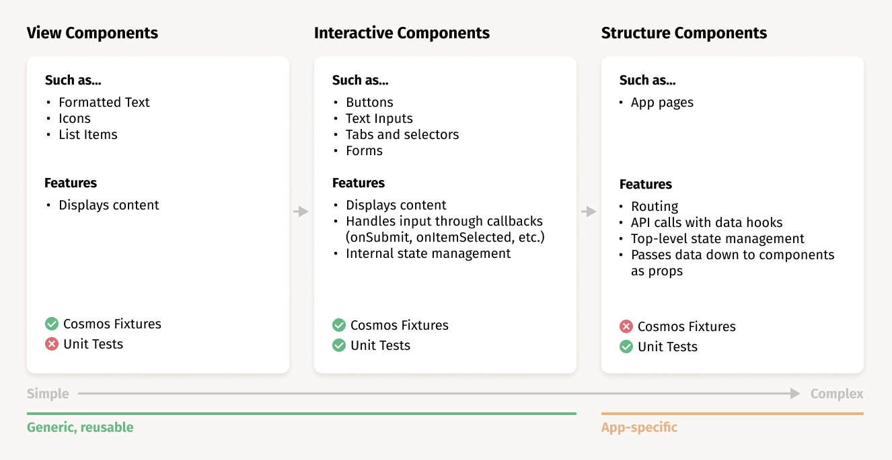

# JAIK RealWorld

This project will prove your ability to contribute to the kind of app you would encounter in the real world. You will be implementing the [RealWorld](https://realworld-docs.netlify.app/docs/intro) benchmark project using JAIK coding standards. You may encounter things during this process that you didn't cover in school. Feel free to take full advantage of all the knowledge the internet has to offer; look at other implementations of RealWorld, read docs for libraries you're unfamiliar with, watch YouTube videos on how to use new tools.

RealWorld comes with some pretty comprehensive documentation on what is expected. Plus, the design and the API are already done for you, so this really is a 100% front end implementation. See [this demo](https://demo.realworld.io/#/) of the completed app.

The auth pages, a handful of hooks and a `<Header>` component are already created to get you started and show how things should look. The rest of the app is up to you.

## Dev Tools & Recommended Reading

First of all, we build frontends in [React](https://reactjs.org/docs/getting-started.html) with [create-react-app](https://create-react-app.dev/docs/getting-started) to hide most of the build system configuration complexity.

We use [Cosmos](https://reactcosmos.org/) for developing View and Interactive components (see next section for component types).

All API access happens through [React hooks](https://reactjs.org/docs/hooks-intro.html) in our apps. We use [React Query](https://react-query.tanstack.com/) to perform the actual API calls. This takes care of caching data between instances of each hook and refreshing stale data without a whole lot of effort on the developer's part. The actual API calls backing those queries are made with [Axios](https://axios-http.com/).

Unit tests are done with [Jest](https://jestjs.io/). In both unit tests and Cosmos fixtures, we use [MSW](https://mswjs.io/) to intercept and mock API calls so we're testing our logic on its own instead of hitting a real API.

## Development Workflow

- Create a new `feature/<your-name>` branch based on `develop`
- Work on your feature
  - Components should be developed in Cosmos first (`npm run cosmos`), **not** directly in the app (`npm run start`)
- Submit a PR to merge `feature/<your-name>` into `develop` for feedback
  - You don't need to be finished to create a PR, just set it as a Draft and mention what you'd like feedback on in your description or in a comment on the PR.
  - If issues are found, they'll be pointed out in comments and the PR will be set to "Waiting for Author"

## A Note on Dependencies

If you bring in any packages to use on the frontend, install them with `npm install --save-dev <package>` so they go in devDependencies. These packages don't need to be present at runtime because they're compiled into the app at build time. If you plan to use a package inside of `server.js` at runtime then skip the `--save-dev`.

## Component Types

We consider all components one of three types:



> NOTE: Interactive components that don't take custom callbacks might not need unit tests. Cosmos fixtures will usually showcase if the internal state management is working when you interact with the component. Use your best judgement on a component-by-component basis. Write unit tests when you need to prove to yourself that your component is working correctly and Cosmos fixtures don't make that obvious.

## Style Guide

This project has some conventions about how things are named and how files are organized.

Certain directories may have `README.md` files in them to explain further if there are details you need to know that don't fit cleanly into the top level README.

### Where to put stuff

- View and Interactive components that are meant to be reused in many places go in `src/components`
- Structure components go in `src/pages`
- Hooks go in `src/hooks`
- View and Interactive components that are only used on one page go inside that page's folder (`src/pages/<StructureComponent>`)

### Components

Components should be organized like so:

```
components/
  ComponentName/
    ComponentName.jsx (the component file itself)
    ComponentName.module.css (the component's stylesheet)
    ComponentName.fixture.jsx (Cosmos fixtures for the component)
    ComponentName.test.js (Jest test suite)
    index.js (imports ComponentName and exports it as the default -- for cleaner imports)
```

For this folder structure to work, `ComponentName.jsx` should export its component by name:

```jsx
export function ComponentName(props) {
  return <div>Content</div>;
}
```

And `index.js` should re-export the component like so:

```jsx
import { ComponentName } from "./ComponentName.jsx";

export default ComponentName;
```

Now, in any other file in the project you can import the above component like so:

```jsx
import ComponentName from "components/ComponentName";
```

This convention seems like a lot of extra files at first, but it's a result of a lot of experience making apps. It does two things well:

1. Keeps names distinct for the component files you're working on. This makes it easier to see what you have in your editor tabs.
2. Allows you to do the nice, clean import syntax demonstrated above.

### Comments and PropTypes

_ALL_ components, hooks and other functions should have detailed doc comments above them explaining what they're for and how they are intended to be used. Those look like this:

```jsx
/**
 * Demonstrates what doc comments are supposed to look like.
 * Use doc comments to explain anything a new developer might not immediately
 * be able to tell just by reading your code. You can also sprinkle single line
 * comments throughout your components to make things even clearer.
 */
export function ComponentName(props) {
  return <div>Content</div>;
}
```

In addition, we use the [`prop-types`](https://www.npmjs.com/package/prop-types) library to provide some development-time type checking. This requires you to define the data types for the component's props, and if they don't match the actual data being passed in you will see a warning in the browser console.

You should strive to be as detailed as possible when defining propTypes. This tool is there to help you, the developer, find out if your expectations are matching the reality. It's far better to be warned about this in advance than to find out by tracing obscure bugs once the app is released.

```jsx
import PropTypes from "prop-types";

/**
 * View component. Displays the name and status for a single user.
 */
export function ExampleComponent({ name, status }) {
  return (
    <div>
      <h1>{name}</h1>
      <p>{status}</p>
    </div>
  );
}

ExampleComponent.propTypes = {
  /**
   * The user's name.
   */
  name: PropTypes.string.isRequired,

  /**
   * The user's online status. Usually 'online', 'away', or 'busy', but can be anything.
   */
  status: PropTypes.string.isRequired,
};
```

### Hooks

Hooks have a similar structure to components:

```
hooks/
  useHook/
    useHook.js (the hook file itself)
    useHook.test.js (Jest test suite)
    index.js (imports useHook and exports it as the default -- for cleaner imports)
```

Hooks don't use have propTypes, but they should be clean and include helpful comments:

```js
import axios from "axios";
import { useQuery, useMutation, useQueryClient } from "react-query";

/**
 * View component. Displays the name and status for a single user.
 */
export function useUserData(userId) {
  const queryClient = useQueryClient();

  const userQuery = useQuery(["users", userId], () => {
    return axios(`/users/${userId}`, { method: "get" }).then((res) => {
      return res.data;
    });
  });

  const updateUserMutation = useMutation(
    (userData) => {
      return axios(`/users/${userData.id}`, {
        method: "put",
        data: JSON.stringify(userData),
      });
    },
    {
      onSuccess: () => {
        // Invalidate and re-fetch data for this user when it's updated through the API.
        queryClient.invalidateQueries(["users", userId]);
      },
    }
  );
}
```

## Scripts

In the project directory, you can run:

### `npm run cosmos`

Launches Cosmos for component development. This is extremely similar to Storybook, but faster and less finicky with project dependency versions. See [Cosmos docs here](https://github.com/react-cosmos/react-cosmos/blob/main/docs/README.md#fixtures).

### `npm test`

Launches the test runner in the interactive watch mode.<br />
See the section about [running tests](https://facebook.github.io/create-react-app/docs/running-tests) for more information.

### `npm start`

Runs the app in the development mode.<br />
Open [http://localhost:3000](http://localhost:3000) to view it in the browser.

The page will reload if you make edits.<br />
You will also see any lint errors in the console.

### `npm run build`

Builds the app for production to the `build` folder.
It correctly bundles React in production mode and optimizes the build for the best performance.

The build is minified and the filenames include the hashes.
